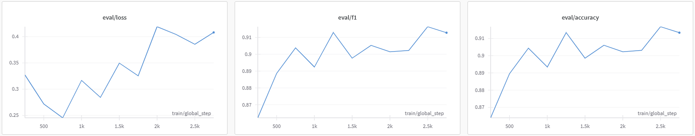

# DNABERT Modeling

## Fine-tuning
### 1. DNABERT-2 모델 준비
   - Source Code: ```!git clone https://github.com/MAGICS-LAB/DNABERT_2.git```
   - Hugging Face에서 Pre-trained Model및 Tokenizer 로드:  ```from transformers import AutoTokenizer, AutoModelForSequenceClassification```
<br>

### 2. Fine-tuning
   - Colab A100 GPU 사용
   - 학습 효율을 높이기 위해 ```train_batch_size = 64``` (```gradient_accumulation_steps = 2```), ```eval_batch_size = 128```로 변경하였으며, ```5 epoch```를 학습했다. 
   - ```save_steps = 250```, ```eval_steps = 250```으로 설정하여 250 steps 마다 모델을 평가하고 저장하였다. 결과는 아래와 같다.  
   - 그 외의 주요 parameter는 default 값을 사용하였다. 
   
<br>
<br>

## FeatureVector
### 1. DNABERT-2 모델 사용
   - Fine-tuning할 때와 마찬가지로 DNABERT-2 모델을 준비해주었다. 
   - Fine-tuning checkpoint 중 가장 마지막 모델(```checkpoint-2750```)을 사용하여 Feature Vector를 추출하였다. 
   - Input size가 크므로 ```batch_size = 64```로 지정해주었다. 
   - train, dev, test set 각각에 대해 Fine-tuning된 Model을 돌린 후 마지막 hidden state를 추출하였다.
<br>

### 2. Attention 기반의 weighted Average 사용
   - Mutation 영역에 더 많은 가중치를 할당할 수 있도록 Attention 기반의 weighted Average를 사용하였다. 
   - 마지막 hidden state를 이용해 Attention Weight를 구하고, 이를 다시 마지막 hidden state에 곱해 최종 Feature Vector를 생성하였다. 
   - 이후 분석이 용이하도록 label은 별도로 저장하였다. 
   - 생성한 Feature Vector를 Input으로 하여 ML 분석을 진행하였다. 
<br>


